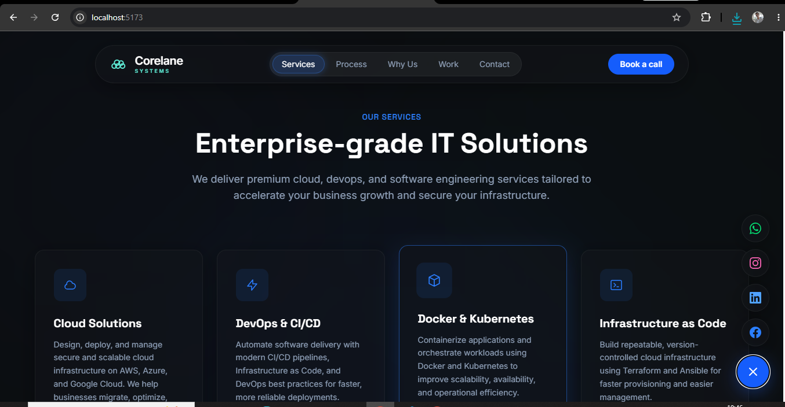
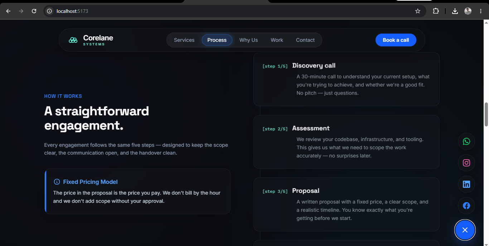
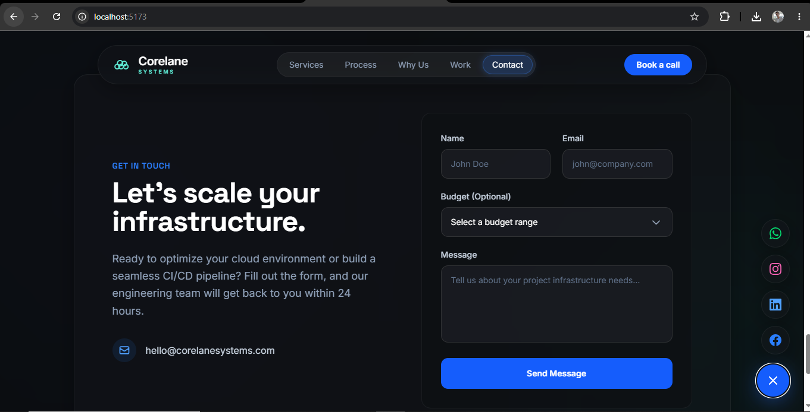
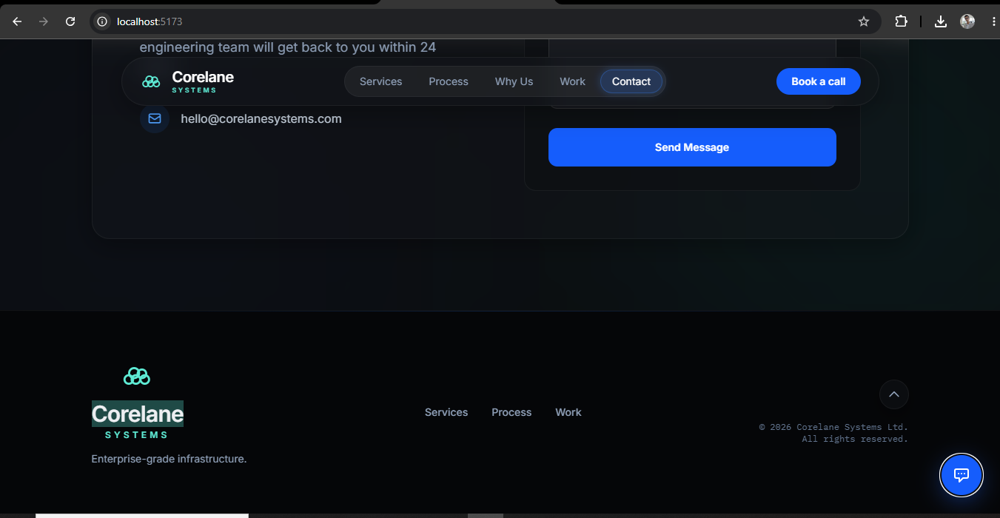

# Corelane Systems — Marketing Website

A dark-themed, single-page marketing website for **Corelane Systems**, a premium DevOps & infrastructure consultancy. Built with React 19, Vite 8, and Tailwind CSS v4.

## Tech Stack

- **React 19** — UI
- **Vite 8** — dev server & bundler (Rolldown)
- **Tailwind CSS v4** — styling via `@tailwindcss/vite`
- **Oxlint** — linting

## Sections

| Section | Description |
|---|---|
| Hero | Headline, pipeline strip, and CTAs |
| Services | Offered DevOps/infrastructure services |
| Process | 5-step engagement flow |
| Why Corelane | Value propositions (fixed pricing, founder-led, etc.) |
| Case Studies | Past work showcase |
| Contact | Contact form |
| Footer | Links and social |

A floating social menu (WhatsApp, Instagram, LinkedIn, Facebook) is fixed to the right edge.

## Screenshots

**WhatsApp Preview**


**Hero**


**Services**


**Process & Why Corelane**


**Contact**


**Footer**


## Getting Started

```bash
npm install
npm run dev
```

| Script | Action |
|---|---|
| `npm run dev` | Start dev server at `localhost:5173` |
| `npm run build` | Production build to `dist/` |
| `npm run preview` | Preview the production build |
| `npm run lint` | Run Oxlint |

## Project Structure

```
src/
├── components/   # All page sections and UI components
├── hooks/        # useScrollReveal custom hook
├── assets/       # Static images
└── App.jsx       # Root component
```
